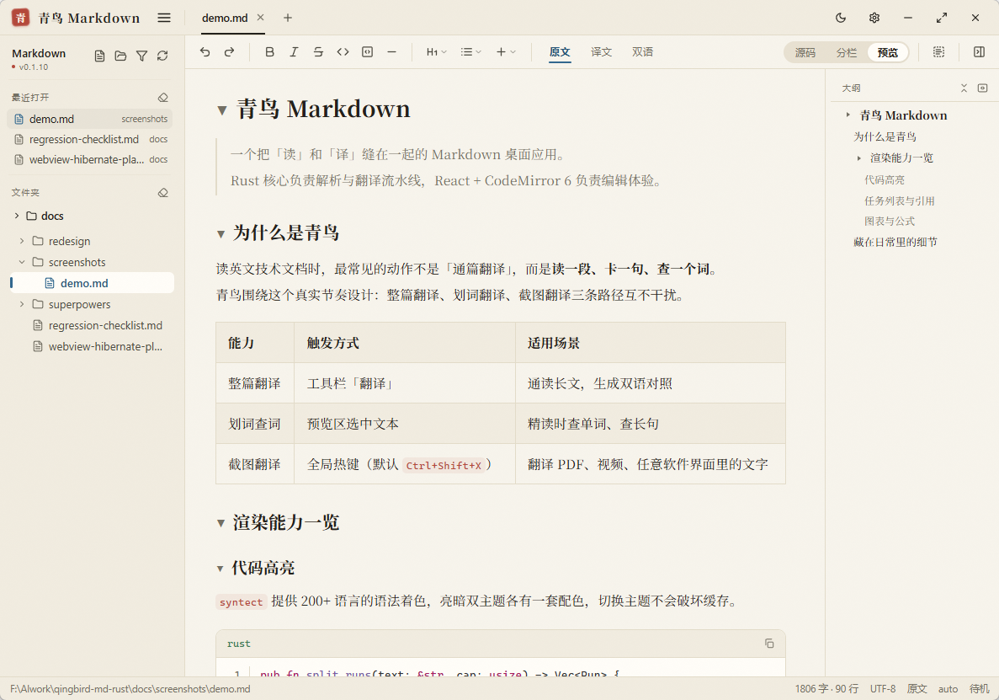
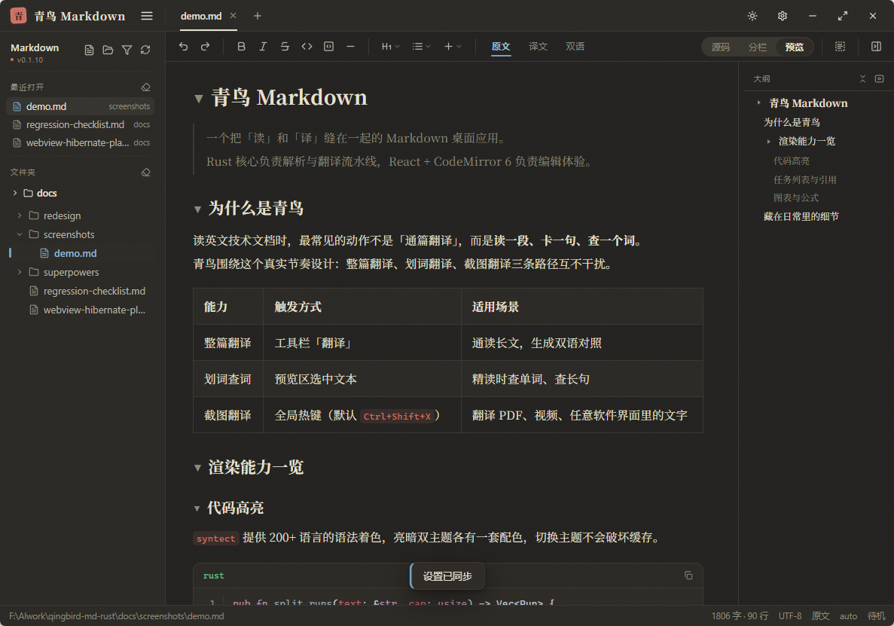
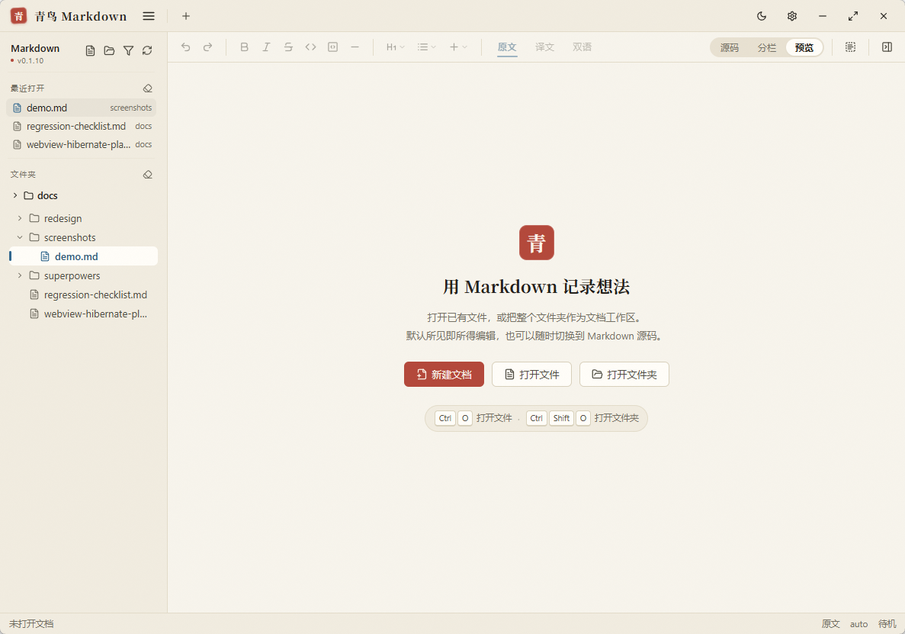
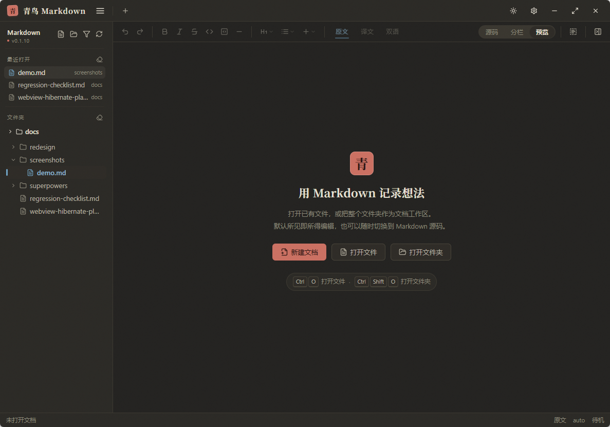

# 青鸟 Markdown（qingbird-md）

[](LICENSE) [](https://gitee.com/muyan1983/qingbird-md/releases) [](https://gitee.com/muyan1983/qingbird-md/releases) [](CHANGELOG.md)

带流式中英翻译的 Markdown 桌面编辑器。**Rust 核心 + React/TypeScript 前端 + Tauri 2**， 面向「读英文技术文档、写双语内容」的场景设计——选中即译、整篇流式翻译、框选屏幕就能译。

下载 Windows 安装包（约 9.4 MB）：**[Gitee Releases](https://gitee.com/muyan1983/qingbird-md/releases)** ↓



## 为什么值得一试

* **开箱即译，零配置**：内置三个免密钥翻译源（腾讯 Transmart / 金山 iCiba / MyMemory）， 装完就能翻整篇文档；`auto` 模式自动按序兜底，不需要申请任何 API。
* **流式翻译，首段约 1.5 秒上屏**：译文边生成边上屏，不是等整篇翻完一次性给； LLM 源逐字流式返回，普通段落按块打字机回填，长文档不再干等。
* **既是阅读器也是常驻工具**：关闭窗口隐藏到托盘，全局热键随手框选屏幕即译； 空闲 5 分钟自动休眠主窗口 WebView，常驻内存还给系统，托盘 / 热键 / 截图翻译照常工作。

## 界面

明暗两档 × 六套纸色配色，正文宽度可拖拽或走四档预设——阅读区、代码块、标题栏全部随配色一起走。

**阅读页（明 / 暗）**




**欢迎页（明 / 暗）**





## 功能总览

### 编辑与阅读

| 能力 | 说明 |
|---|---|
| Markdown 渲染 | 标题 / 列表（含任务）/ 表格 / 引用 / 代码高亮（syntect）/ 行内格式 / 链接；支持 mermaid 图表与 KaTeX 公式 |
| 三种视图 | 源码 / 预览 / 分栏自由切换；正文宽度可自由拖拽，另有四档预设（紧凑 640 / 标准 794 / 宽 1000 / 全宽 1200） |
| 编辑器 | CodeMirror 6，格式工具栏（粗斜体 / 标题 / 列表 / 引用 / 代码 / 链接 / 图片 / 表格 / 分割线），撤销重做与脏点标记 |
| 文档管理 | 左侧文档树（递归扫描工作区 .md、搜索过滤）、标签页多开、右侧大纲（h1–h3 目录） |
| 阅读体验 | **明暗两档 × 六套纸色配色**（宣纸 / 青花 / 墨玉…）、**快捷键全部可自定义**、状态栏（路径 / 实际编码 / 行列字符数） |

### 中英翻译（核心）

| 能力 | 说明 |
|---|---|
| 8 个翻译源 | MyMemory（免密）、有道智云、腾讯云 TMT、百度翻译、自定义大模型（OpenAI 兼容，流式）、腾讯 Transmart（免密）、金山 iCiba（免密）、auto 免密兜底 |
| 流式引擎 | 分段并发、逐单元边翻边上屏；只重试缺失单元；命中缓存的段落先出，不占用网络 |
| 翻译缓存 | 内存 + 磁盘双缓存，键含模型名与提示词版本——换模型 / 改提示词后旧译文自动失效，无需手动清缓存 |
| 三种阅读模式 | 译文 / 原文 / 中英对照（双语逐段对齐，打字机按文档序回填） |
| 划词查词 | 选中英文即弹释义浮窗；可用独立轻量「查词模型」，不打断阅读 |
| 智能分段 | 相邻短段合并减少请求，超长段自动分块，兼顾速度与质量 |
| 译文导出 | **译文另存为…**（`Ctrl+Shift+E`）：单语模式导出纯译文，中英对照模式导出「原文 + 译文」逐段对照稿；代码 / 公式 / 图片等不可译块只出原文，未译段落保留原文 |
| 译文检查 | **确定性检查**（零 AI 成本）：漏译 / 原文充译 / 标记丢失 / 结构不对等 / 代码被侵入五类结构比对，在右侧 **AI 核查面板**（`Ctrl+J`）按类别看计数 |

### 截图翻译（OCR）

全局热键框选屏幕任意区域 → 有道 OCR 识别 → **译文浮窗实时覆盖在原位**。 看 PDF、图片、视频字幕、无法复制的页面都能译；热键可在设置中自定义。

### 桌面体验与可靠性

* **系统托盘常驻**：关闭主窗口 = 隐藏到托盘（菜单：显示窗口 / 截图翻译 / 开机自启 / 退出），开机自启可关
* **设置面板**：左栏五大分类（外观 / 翻译与模型 / 快捷键 / 数据与维护 / 关于），顶部胶囊搜索直达任意设置项；**关窗即自动保存**
* **大模型多档案**：可保存多份 LLM 配置（接口地址 / Key / 模型名）随时切换；厂商预设仅作新建时的模板，不再互相覆盖
* **主窗口按需休眠**：空闲 5 分钟真正销毁 WebView 省内存；唤醒后自动恢复标签、未保存草稿、光标 / 滚动 / 面板宽度；休眠期间双击 `.md` 照常打开
* **编辑器可靠性**：外部修改检测（聚焦时比对 mtime）、保存前冲突检测、非 UTF-8 文件读取兜底（自动按 GB18030 解码并在状态栏标注，保存一律 UTF-8）
* **导出独立 HTML**：主题与样式全部内联，mermaid / KaTeX 取预览已渲染产物，本机图片转 `file://` 绝对路径——单文件带走，随处可看
* **命令面板**（Ctrl+Shift+P）：输入文件名片段即搜工作区文件并打开，`>` 前缀只搜命令
* **单实例 + 文件关联**：双击 `.md` / 命令行传参直达已运行实例

## 翻译源一览

| 源 | 密钥 | 单条上限 | 说明 |
|---|---|---|---|
| auto 免密自动 | 不需要 | 1000 | 默认推荐：腾讯 Transmart → 金山 iCiba → MyMemory 顺序兜底 |
| 腾讯 Transmart | 不需要 | 2000 | 浏览器端点，国内裸连稳定，长文档首选 |
| 金山 iCiba | 不需要 | 1000 | 词霸批量翻译，国内可用 |
| MyMemory | 不需要 | 500 | 无需申请，适合先试用 |
| 自定义大模型 | 视服务 | 3000 | 任意 OpenAI 兼容接口：DeepSeek / 通义 / 智谱 / 本地 Ollama 均可，流式返回，可另配查词模型 |
| 有道智云 | 需要 | 5000 | 文本翻译服务 |
| 腾讯云 TMT | 需要 | 6000 | 机器翻译服务 |
| 百度翻译 | 需要 | 6000 | 通用翻译 API |

## 快速开始（开发）

环境：Windows 10/11 + Rust **1.85+**（`edition 2024`）+ Node.js **≥20**。

```bash
npm i          # 安装前端依赖
npx tauri dev  # 首次会先起 vite，Rust 侧编译较慢属正常
```

## 测试与构建

```bash
cargo test --workspace   # Rust 核心单测（翻译引擎 / 缓存 / 编辑逻辑等）
npm test                 # 前端 vitest（IPC 契约、打字机缓冲等）
npm run build            # tsc 严格编译 + vite 构建

npx tauri build          # 打包 NSIS 安装器（src-tauri/target/release/bundle/nsis/）
```

## 发布到 Gitee Releases

云端 CI（Gitee Go 等）只有 Linux 容器、无法编译 Windows 安装包，因此构建在本地执行， 发布脚本负责校验、打包与上传。详见 [scripts/publish-gitee.py](scripts/publish-gitee.py) 的用法注释：

```bash
python scripts/publish-gitee.py --set-token <TOKEN>  # 首次：存入令牌（%APPDATA%，不进仓库）
python scripts/publish-gitee.py --dry-run            # 先看计划
python scripts/publish-gitee.py                      # 构建并发布 vX.Y.Z 到 Releases
```

## 架构

```
src-tauri/src/            # Rust 核心（全部业务逻辑）
├── markdown/             # pulldown-cmark 解析 + HTML 渲染 + syntect 高亮
├── translate/            # 翻译引擎：签名 / 8 源注册 / 分批 / 流式（sse）/ 缓存 / 查词
├── capture/              # 截图翻译：框选（screen）+ 有道 OCR + 浮窗（window）
├── lib.rs                # Tauri setup + IPC 命令 / 事件接线
├── editor.rs             # Markdown 编辑操作（纯逻辑，可测试）
├── workspace.rs          # 工作区 .md 树遍历 + 搜索过滤
├── storage.rs            # 设置 / 缓存持久化（.bak 防损坏）
├── single_instance.rs    # 单实例锁 + 文件参数 handoff
├── hotkeys.rs            # 全局热键
├── tray.rs               # 系统托盘
└── hibernate.rs          # 主窗口 WebView 按需休眠
src/                      # React / TypeScript 前端
├── components/           # CodeMirror 6 编辑器、预览、工具栏、菜单、命令面板…
├── stores/               # zustand 状态（doc / translation / settings / ui / workspace）
├── lib/                  # ipc.ts 类型化调用层、打字机缓冲、导出 HTML…
└── types/ipc.ts          # Rust↔TS 线格式契约（逐字段对齐 + 测试锁定）
```

设计要点（对开发者友好）：

* **流式优先**：TTFT（首字节延迟）是唯一被感知的延迟。整批等待 + 行数对齐的旧管线 改为**分隔符批处理协议**边解边发，首个段落秒级落地，真正缺失的单元才并发重试。
* **内容寻址的缓存**：缓存键 = 文本 + provider（LLM 额外含 model + 提示词版本）， 改模型 / 改提示词即自动失效，杜绝「旧译文阴魂不散」。
* **翻译不进 WebView**：翻译引擎 / 截图 / 缓存全在 Rust 侧与 WebView 无关—— 这正是休眠时它们不受影响的底气。
* **可测试的边界**：Rust↔TS 的 IPC 契约逐字段对齐并由两端测试锁定，前端渲染有 happy-dom 测试，翻译引擎全部逻辑离线可测（MockClient）。

## 数据与隐私

* 设置与翻译缓存存于 `%APPDATA%\\\\qingbird-md\\\\`（`qingbird-settings.json` / `qingbird-cache.json`）
* **API 凭据仅存本机**设置文件，输入框以 `password` 渲染，不进日志 / 截图 / 上报 / git 历史
* 设置文件损坏时自动备份 `.bak` 并回退默认值，下次保存重建

## 文档

* 变更记录：[CHANGELOG.md](CHANGELOG.md)（Keep a Changelog + SemVer）
* 设计 spec：[tauri-v2-design](docs/superpowers/specs/2025-06-16-tauri-v2-design.md) ｜ 实施计划：[tauri-v2-gui-migration](docs/superpowers/plans/2026-08-27-tauri-v2-gui-migration.md) ｜ 回归清单：[regression-checklist.md](docs/regression-checklist.md)
* 主窗口休眠设计：[webview-hibernate-plan](docs/webview-hibernate-plan.md)

## 当前限制

如实记录，迭代中：

1. 冷启动后极短窗口内（监听挂载前）的全局热键 / 单实例首开事件可能丢失，再触发一次即可
2. 模态弹窗打开时，编辑器快捷键（如粗体 / 斜体）仍作用于背景文档，未做弹窗门控
3. 工作区「新建目录」当前按 Windows 路径分隔符实现

## 贡献与反馈

* **Bug / 需求**：在 [Gitee Issues](https://gitee.com/muyan1983/qingbird-md/issues) 提交， 请附最小复现路径与系统信息（Windows 版本、WebView2 版本号）
* **人工回归手测**：见 [docs/regression-checklist.md](docs/regression-checklist.md)