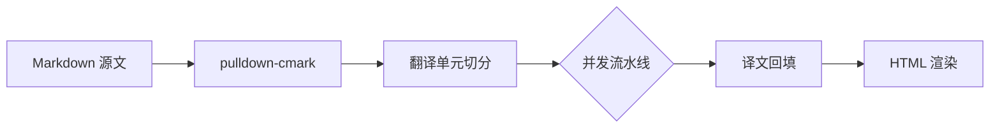

# 青鸟 Markdown

> 一个把「读」和「译」缝在一起的 Markdown 桌面应用。
> Rust 核心负责解析与翻译流水线，React + CodeMirror 6 负责编辑体验。

## 为什么是青鸟

读英文技术文档时，最常见的动作不是「通篇翻译」，而是**读一段、卡一句、查一个词**。
青鸟围绕这个真实节奏设计：整篇翻译、划词翻译、截图翻译三条路径互不干扰。

| 能力 | 触发方式 | 适用场景 |
| --- | --- | --- |
| 整篇翻译 | 工具栏「翻译」 | 通读长文，生成双语对照 |
| 划词查词 | 预览区选中文本 | 精读时查单词、查长句 |
| 截图翻译 | 全局热键（默认 `Ctrl+Shift+X`） | 翻译 PDF、视频、任意软件界面里的文字 |

## 渲染能力一览

### 代码高亮

`syntect` 提供 200+ 语言的语法着色，亮暗双主题各有一套配色，切换主题不会破坏缓存。

```rust
pub fn split_runs(text: &str, cap: usize) -> Vec<Run> {
    let mut runs = Vec::new();
    let mut buf = String::new();

    for line in text.lines() {
        if buf.chars().count() + line.chars().count() > cap && !buf.is_empty() {
            runs.push(Run::new(std::mem::take(&mut buf)));
        }
        buf.push_str(line);
        buf.push('\n');
    }
    if !buf.trim().is_empty() {
        runs.push(Run::new(buf));
    }
    runs
}
```

```typescript
export async function translateDoc(docId: string): Promise<void> {
  const store = useTranslationStore.getState();
  store.begin(docId);

  for await (const chunk of streamTranslate(docId)) {
    store.applyPartial(docId, chunk);
  }

  store.finish(docId);
}
```

### 任务列表与引用

- [x] Markdown 解析与 HTML 渲染
- [x] 七种翻译源 + `auto` 兜底链
- [x] 多标签页与会话恢复
- [ ] 协作编辑

### 图表与公式

Mermaid 以 `securityLevel: 'strict'` 渲染，拒绝执行源码内脚本：



行内公式如 $E = mc^2$，块级公式：

$$
\int_{-\infty}^{\infty} e^{-x^2}\,dx = \sqrt{\pi}
$$

---

## 藏在日常里的细节

关闭窗口并不退出 —— 青鸟缩到系统托盘，托盘菜单里能直接唤起截图翻译。
窗口隐藏满 5 分钟后，WebView 会被真正销毁，把常驻内存还给系统；
再次唤醒时会话完整恢复，标签、未保存草稿、光标位置都还在。

用 `Ctrl+Shift+P` 打开命令面板，输入文件名片段即可直开工作区里的任意文档。
